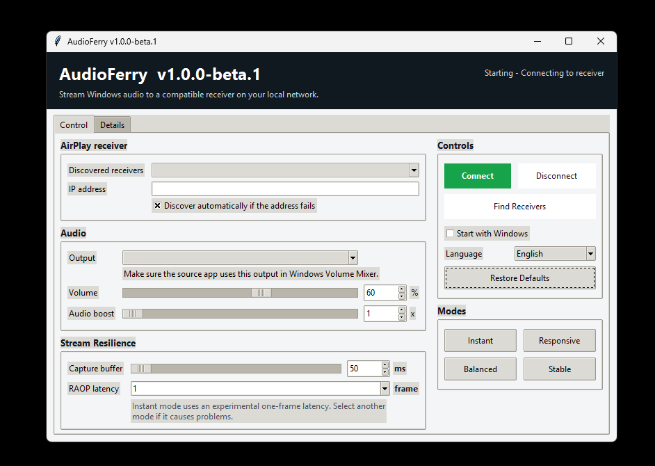
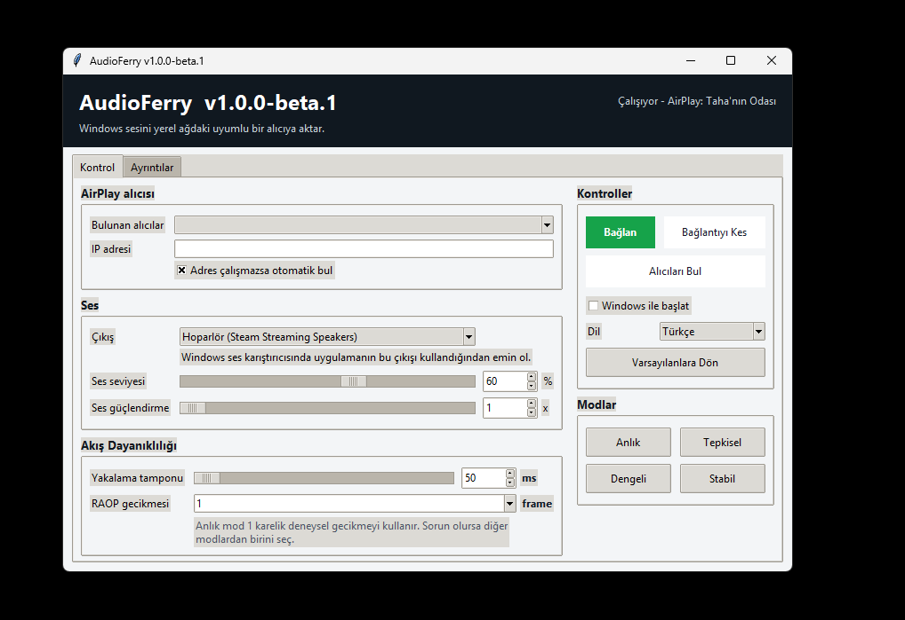

# AudioFerry

[⬇️ Download Latest Release](https://github.com/tnsozcan/AudioFerry/releases/latest) · [📖 Documentation](https://github.com/tnsozcan/AudioFerry#readme)

## English

AudioFerry is a lightweight Windows application that streams system audio to compatible AirPlay receivers, including Apple HomePod devices.

> Status: beta v1.0.0-beta.1. The application builds and its offline paths are tested, but end-to-end audible playback still requires hardware acceptance testing.

### Features

- Captures a selected Windows output device through WASAPI loopback.
- Discovers RAOP/AirPlay devices on the local network and lists all matches.
- Connects, disconnects, and automatically retries after a stream error.
- Turkish and English UI, selected automatically from the Windows language and changeable in the control panel.
- Controls receiver volume, local capture boost, capture resilience, and raw RAOP latency down to one frame.
- Shows connection state and recent local logs in a desktop control panel and tray icon.
- Can optionally start for the current user with Windows.

### Screenshots



### Requirements

- 64-bit Windows and Python 3.11 for source builds. Exact Windows editions have not been systematically tested.
- A HomePod or RAOP/AirPlay audio receiver on the same local network. HomePod software versions have not been systematically tested.
- An audio output exposed to Windows WASAPI loopback.

### Installation

Download/extract `AudioFerry-v1.0.0-beta.1-win-x64.zip`, then run `AudioFerry.exe`. The binary is not code-signed, so Microsoft Defender SmartScreen may display an unknown-publisher warning. Only continue if the SHA-256 checksum matches `SHA256SUMS.txt` from the same release.

### Usage

1. Open the control panel and click **Find Receivers** / **Alıcıları Bul**.
2. Select a discovered device and the Windows output to capture.
3. Click **Connect** / **Bağlan**.
4. Use **Disconnect** / **Bağlantıyı Kes** before changing network or audio devices when possible.

On first run, streaming remains stopped until settings are saved and **Connect** is clicked. Later runs reconnect automatically to the saved configuration. The current-user **Start with Windows** option writes an HKCU Run entry, starts minimized in the notification area, and does not require administrator rights.

### Building from Source

```powershell
py -3.11 -m venv .venv
.\.venv\Scripts\Activate.ps1
python -m pip install --upgrade pip
python -m pip install -r requirements-dev.txt
powershell -NoProfile -ExecutionPolicy Bypass -File .\scripts\verify.ps1
powershell -NoProfile -ExecutionPolicy Bypass -File .\scripts\build-release.ps1
```

Tests cover startup/version output, config parsing, invalid values, malformed config recovery, and an empty discovery result. Hardware playback requires a real receiver and is not automated.

### Configuration

The packaged application stores `bridge_config.json`, `bridge.log`, and `bridge.err.log` under `%APPDATA%\AudioFerry`. Logs rotate at 2 MB with three backups. Source runs use the project directory. See `config.example.json`; never publish a real config or logs because they can contain local IP addresses and device names.

### Known Issues

- End-to-end HomePod discovery and audio playback are not verified in the release environment.
- Instant mode uses an experimental one-frame RAOP latency proven on the development hardware; receiver behavior can vary.
- The RAOP path uses internal `pyatv` interfaces, so future `pyatv` upgrades can require code changes.
- Password-protected receivers and all pairing/authentication combinations are not tested.
- The executable is unsigned and may trigger SmartScreen.

### Troubleshooting

- Ensure Windows and the receiver are on the same LAN/VLAN and that multicast discovery is allowed.
- Allow the application through Windows Firewall on private networks if discovery is empty.
- Select the same Windows output that the source application is using.
- AudioFerry automatically tries common Windows mix formats (44.1/48/96 kHz) and converts compatible audio to AirPlay's stream format.
- For minimum delay use **Instant** (`1 frame / 50 ms`). If playback is unstable, step up through Responsive, Balanced, and Stable.
- If audio crackles, try a 150–300 ms buffer and the **Stabil** preset.
- Inspect `%APPDATA%\AudioFerry\bridge.err.log`; remove personal data before sharing it.
- Run `python audioferry_app.py --list-devices` in a source checkout to inspect audio devices.

### Privacy

AudioFerry contains no telemetry, analytics, account system, or cloud service. Captured audio is sent directly to the selected AirPlay receiver on the local network. Discovery uses mDNS on UDP 5353. RAOP/AirPlay then connects to the service port advertised by the receiver and negotiates additional local RTP/control/timing ports; these ports are receiver-dependent. Logs remain local but can include receiver and audio-device names.

### Third-Party Components

See [THIRD_PARTY_NOTICES.md](THIRD_PARTY_NOTICES.md). Dependencies retain their own licenses; `pystray` and `zeroconf` are LGPL components. The AudioFerry source itself is MIT-licensed.

Apple, AirPlay, and HomePod are Apple trademarks. AudioFerry is an independent project and uses those names only to describe compatibility; see [TRADEMARKS.md](TRADEMARKS.md).

### Contributing

See [CONTRIBUTING.md](CONTRIBUTING.md). Please do not attach private IP addresses, device names, or raw logs to public reports.

### License

Copyright © 2026 Taha Enes. AudioFerry source code is available under the [MIT License](LICENSE).

---

## Türkçe

AudioFerry, Windows sistem sesini HomePod dahil uyumlu AirPlay alıcılarına aktarmanızı sağlayan hafif bir masaüstü uygulamasıdır.

> Durum: beta v1.0.0-beta.1. Uygulama derlenmiş ve çevrimdışı yolları test edilmiştir; ancak duyulabilir uçtan uca oynatma için donanım kabul testi hâlâ gereklidir.

### Özellikler

- Seçilen Windows ses çıkışını WASAPI loopback ile yakalar.
- Yerel ağdaki RAOP/AirPlay cihazlarını bulur ve eşleşen cihazları listeler.
- Bağlanma, bağlantıyı kesme ve akış hatasından sonra otomatik yeniden deneme sağlar.
- Windows dilinden otomatik seçilen ve panelden değiştirilebilen Türkçe/İngilizce arayüz sunar.
- Alıcı sesini, yerel ses güçlendirmeyi, yakalama dayanıklılığını ve bir kareye kadar ham RAOP gecikmesini ayarlar.
- Kontrol panelinde ve sistem tepsisi simgesinde bağlantı durumunu ve yerel logları gösterir.
- İsteğe bağlı olarak mevcut kullanıcı için Windows ile başlayabilir.

### Ekran Görüntüleri



### Gereksinimler

- 64 bit Windows; kaynak koddan derleme için Python 3.11. Belirli Windows sürümleri sistematik olarak test edilmemiştir.
- Aynı yerel ağda HomePod veya RAOP/AirPlay ses alıcısı. HomePod yazılım sürümleri sistematik olarak test edilmemiştir.
- Windows WASAPI loopback tarafından görülebilen bir ses çıkışı.

### Kurulum

`AudioFerry-v1.0.0-beta.1-win-x64.zip` paketini açın ve `AudioFerry.exe` dosyasını çalıştırın. Uygulama kod imzalı değildir; Microsoft Defender SmartScreen bilinmeyen yayıncı uyarısı gösterebilir. Yalnızca SHA-256 özeti aynı sürümdeki `SHA256SUMS.txt` ile eşleşiyorsa devam edin.

### Kullanım

1. Kontrol panelini açıp **Alıcıları Bul** düğmesine basın.
2. Bulunan cihazı ve yakalanacak Windows ses çıkışını seçin.
3. **Bağlan** düğmesine basın.
4. Ağ veya ses cihazını değiştirmeden önce mümkünse **Bağlantıyı Kes** düğmesini kullanın.

İlk çalıştırmada kullanıcı **Bağlan** demeden akış başlamaz. Sonraki çalıştırmalar kayıtlı ayara yeniden bağlanır. **Windows ile başlat** seçeneği mevcut kullanıcıya ait HKCU Run kaydını kullanır, bildirim alanında küçültülmüş başlar ve yönetici yetkisi istemez.

### Kaynak Koddan Derleme

Yukarıdaki İngilizce bölümde yer alan PowerShell komutlarını kullanın. Testler; başlangıç/sürüm çıktısı, config okuma, geçersiz değerler, bozuk config kurtarma ve boş cihaz keşfini kapsar. Donanım üzerinden ses aktarımı otomatik test edilmez.

### Yapılandırma

Paketli uygulama ayarları ve logları `%APPDATA%\AudioFerry` altında tutar. Loglar 2 MB sınırında döner ve üç yedek tutulur. Kaynak koddan çalıştırma proje klasörünü kullanır. Örnek için `config.example.json` dosyasına bakın. Gerçek config ve loglarda özel IP veya cihaz adları bulunabileceği için bunları yayımlamayın.

### Bilinen Sorunlar

- HomePod keşfi ve uçtan uca ses aktarımı sürüm ortamında doğrulanmamıştır.
- Anlık mod geliştirme donanımında çalışan deneysel bir karelik RAOP gecikmesini kullanır; sonuç alıcıya göre değişebilir.
- RAOP akışı `pyatv` iç arayüzlerini kullanır; gelecek yükseltmeler kod değişikliği gerektirebilir.
- Şifreli alıcılar ve tüm eşleştirme/kimlik doğrulama türleri test edilmemiştir.
- İmzasız EXE SmartScreen uyarısı gösterebilir.

### Sorun Giderme

- Bilgisayar ile alıcının aynı LAN/VLAN üzerinde olduğunu ve multicast trafiğinin engellenmediğini kontrol edin.
- Keşif boşsa uygulamaya özel ağlarda Windows Güvenlik Duvarı izni verin.
- Kaynak uygulamanın kullandığı Windows çıkışıyla paneldeki çıkışın aynı olduğundan emin olun.
- AudioFerry yaygın Windows karışım biçimlerini (44,1/48/96 kHz) otomatik dener ve uyumlu sesi AirPlay biçimine dönüştürür.
- En düşük gecikme için **Anlık** (`1 kare / 50 ms`) modunu kullanın. Akış kararsızsa sırasıyla Tepkisel, Dengeli ve Stabil moda geçin.
- Cızırtıda **Dengeli** (250 ms) veya **Stabil** (500 ms) modunu deneyin.
- `%APPDATA%\AudioFerry\bridge.err.log` dosyasını inceleyin; paylaşmadan önce kişisel verileri temizleyin.

### Gizlilik

AudioFerry telemetri, analiz, hesap sistemi veya bulut servisi içermez. Yakalanan ses doğrudan yerel ağdaki seçili AirPlay alıcısına gönderilir. Keşif UDP 5353 üzerinden mDNS kullanır. RAOP/AirPlay, alıcının ilan ettiği servis portuna bağlanır ve alıcıya göre değişen ek yerel RTP/kontrol/zamanlama portları uzlaşır. Loglar yerelde kalır fakat alıcı ve ses cihazı adlarını içerebilir.

### Üçüncü Taraf Bileşenler

Ayrıntılar [THIRD_PARTY_NOTICES.md](THIRD_PARTY_NOTICES.md) dosyasındadır. Bağımlılıklar kendi lisanslarını korur; `pystray` ve `zeroconf` LGPL bileşenleridir. AudioFerry kaynak kodu MIT lisanslıdır.

Apple, AirPlay ve HomePod Apple markalarıdır. AudioFerry bağımsız bir projedir ve bu adları yalnızca uyumluluğu açıklamak için kullanır; ayrıntılar [TRADEMARKS.md](TRADEMARKS.md) dosyasındadır.

### Katkıda Bulunma

[CONTRIBUTING.md](CONTRIBUTING.md) dosyasına bakın. Açık hata bildirimlerine özel IP, cihaz adı veya ham log eklemeyin.

### Lisans

Telif hakkı © 2026 Taha Enes. AudioFerry kaynak kodu [MIT Lisansı](LICENSE) ile sunulur.
